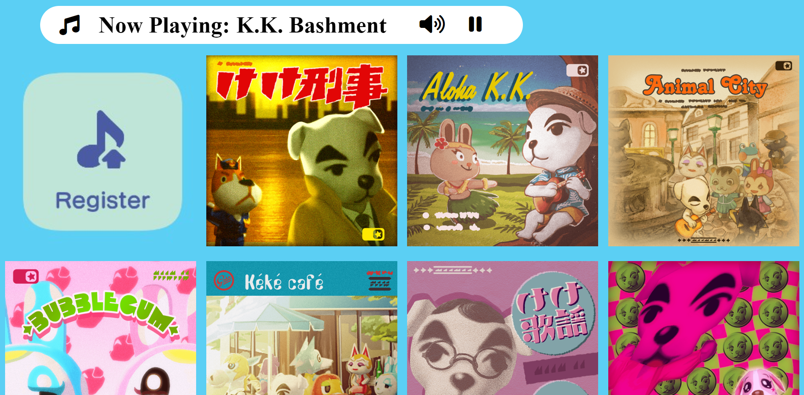

# K.K. Slider Music Player
My partner and I have been collecting the K.K. Slider songs in Animal Crossing New Horizons. I recently found out that we were NOWHERE close to having them all. I decided to make an app that resembled the in game music player so that we could enjoy all of the songs whenever we wanted.

**Link to project:** https://acnhmusicplayer.netlify.app/

## How It's Made:

**Tech used:** HTML, CSS, JavaScript, Framework of choice

I used JS pretty much exclusively here. I started with a factory that created a div. This div took in child elements and attributes that came from a loop on the Animal Crossing API. This gave each Div a unique Id, image and song file.

## Optimizations

The page loads very slowly. 107 songs and images are loaded at the same time. I need to do some work to get these to load a bit differently (or simply on command) to speed up the load time.

I also want to make the UI a bit easier to use on mobile, especially the pause button.

## Lessons Learned:

I learned a lot about creating DOM elements with factories in JS. Using an API in conjunction with that added a layer of difficulty. 

## Examples:
Take a look at these couple examples that I have in my own portfolio using the same API:

[ACNH Tracking Tools](https://acnhcollections.netlify.app/)

**Planned Updates:** 
- [ ] Make Pause Button bigger on mobile
- [ ] Add Highlight Border on Artwork Of Currently Playing Song
- [ ] Add "No Volume" icon when music is paused
- [ ] Add Modal when "Register" icon is clicked

